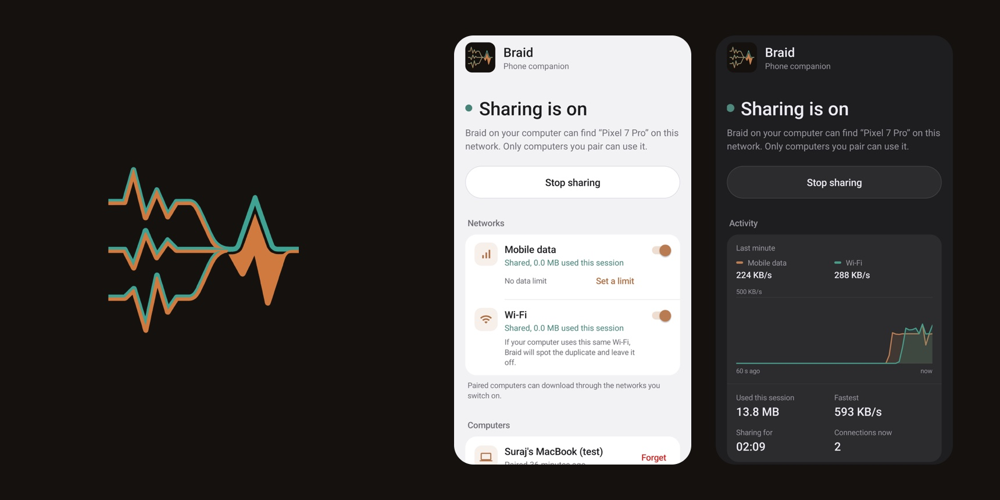
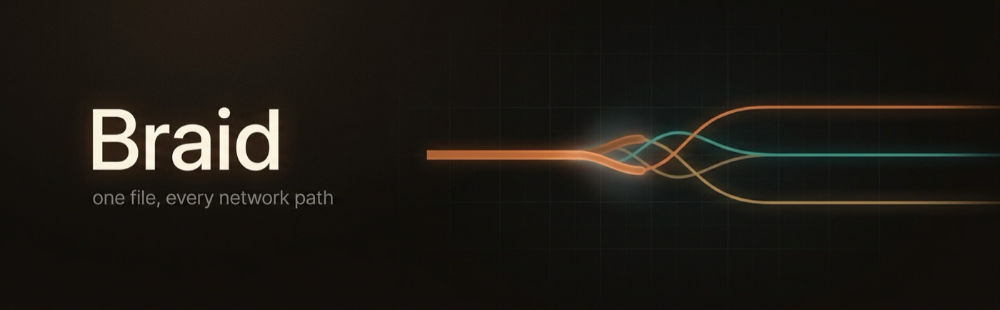
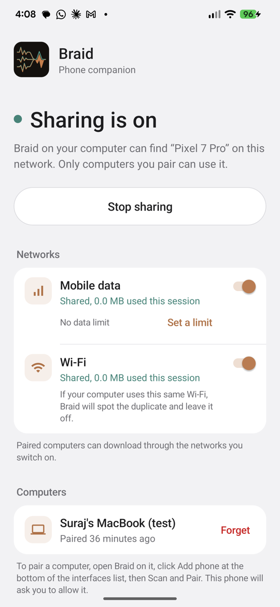
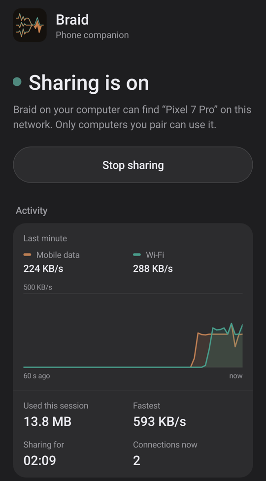
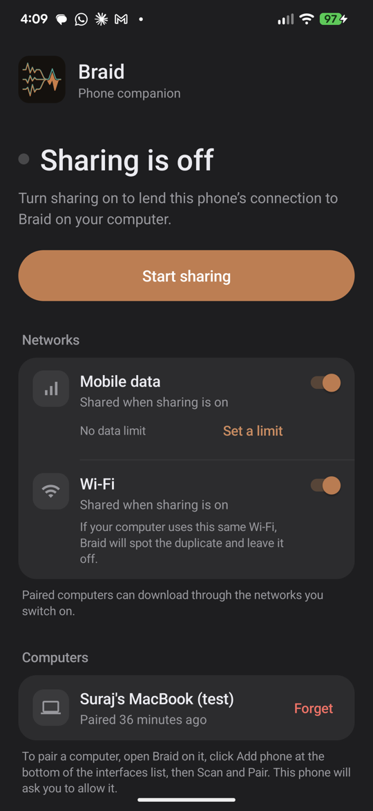
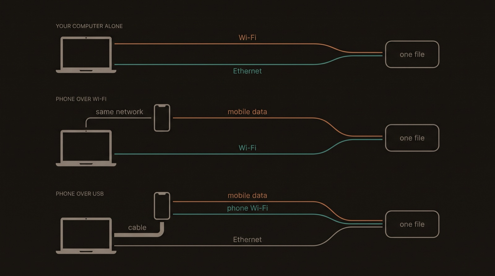

  

<h3 align="center">Turn your phone into a second internet connection for your computer.</h3>

  Braid on your laptop downloads over its own Wi-Fi <i>and</i> your phone's 5G at the same time. 
  This app is the phone half: it lends your mobile data, safely, and only when you say so.

  <a href="#install"><b>Install</b></a> &middot;
  <a href="#works-with-braid-for-your-computer">Braid for your computer</a> &middot;
  <a href="#highlights">Highlights</a> &middot;
  <a href="#screens">Screens</a> &middot;
  <a href="#how-it-works">How it works</a> &middot;
  <a href="DEVELOPMENT.md">Development</a>

  
  
  
  
  

---

## Works with Braid for your computer

<table>
<tr>
<td width="46%"></td>
<td valign="top">
<b><a href="https://github.com/InfoDiveLabs/braid">Braid</a></b> is the download manager this app works with, for macOS,
Windows and Linux. It splits each download across every network your computer has, checks every
chunk, and resumes after a crash without losing the file.  
This app adds your phone to that list. Braid does the downloading; the phone is one more road
to the internet, and shows up in Braid's sidebar with its own speed beside your computer's
Wi-Fi and Ethernet.  
<a href="https://github.com/InfoDiveLabs/braid"><b>Get Braid for your computer</b></a>
</td>
</tr>
</table>

---

## Highlights

<table>
<tr>
<td width="33%" valign="top">
<h4>📶 Real extra bandwidth</h4>
Mobile data and Wi-Fi are separate lanes, each pinned to its own network. Braid splits
every download across them by measured speed and moves work off any lane that stalls.
</td>
<td width="33%" valign="top">
<h4>🎯 Never fakes it</h4>
A lane that says 5G leaves over 5G or refuses, and never slips back to Wi-Fi. If your phone
is on the same Wi-Fi as your laptop, Braid spots the duplicate and leaves that lane off.
</td>
<td width="33%" valign="top">
<h4>🧾 Files arrive exactly right</h4>
Bytes pass through untouched: no compression, no caching, no retries. Braid checks every
chunk on the computer, so a file is either correct or re-fetched.
</td>
</tr>
<tr>
<td width="33%" valign="top">
<h4>📷 Pair with a scan</h4>
Braid on your computer shows a code. Scan it, check the name, tap Add. No typing, and it
works where network discovery doesn't.
</td>
<td width="33%" valign="top">
<h4>🔒 Only on your terms</h4>
Nothing is shared until you pair and switch a network on. Codes only work on your own
network, keys are stored as hashes, and Forget cuts a computer off instantly.
</td>
<td width="33%" valign="top">
<h4>📊 See what it costs</h4>
Live speed per network, data used this session, and an optional mobile-data limit that
pauses sharing when reached. It keeps working with the screen off.
</td>
</tr>
</table>

---

## Screens

<table>
<tr>
<td width="33%" valign="top">
 
<b>What's shared, at a glance.</b> 
One switch per network. Each turns copper while it's carrying data.
</td>
<td width="33%" valign="top">
 
<b>The last minute, live.</b> 
Speed per network, with a crosshair to read any second, and the session's totals.
</td>
<td width="33%" valign="top">
 
<b>Off means off.</b> 
Invisible on the network, and no mobile data connection held open.
</td>
</tr>
</table>

<i>Captured on a Pixel 7 Pro on Jio 5G, in light and dark themes. The paired computer
and the traffic in the chart are test ones, sent through the phone with <code>curl</code>
so the chart had something to show.</i>

---

## Install

Download **`braid-android-x.y.z.apk`** from [Releases](../../releases) and open it on your
phone. The first time, Android asks you to allow installs from your browser or file manager.

<table>
<tr><th>Your device</th><th>Architecture</th><th>Download</th></tr>
<tr><td>Almost every phone since 2017: Pixel, Samsung Galaxy, OnePlus, Xiaomi…</td><td><code>arm64-v8a</code></td><td rowspan="4" align="center"><b>the same single APK</b> no native code, so one file runs on every processor</td></tr>
<tr><td>Older and entry-level 32-bit phones</td><td><code>armeabi-v7a</code></td></tr>
<tr><td>Chromebooks and Intel tablets</td><td><code>x86_64</code></td></tr>
<tr><td>The Android emulator</td><td><code>x86_64</code> / <code>x86</code></td></tr>
</table>

Requires Android 8.0 or newer, and [Braid on your computer](https://github.com/InfoDiveLabs/braid)
(macOS, Windows or Linux) from the desktop repository's Releases.

### Get going in a minute

1. Open the app, tap **Start sharing**, and switch on **Mobile data**.
2. In Braid on your computer, click **Add phone** at the bottom of the interfaces list.
3. On the phone, tap **Add to a computer by code**, scan, and tap **Add**.

That's it: the phone appears in Braid's sidebar with its own speed, beside your
computer's own connections.

No Google Play services? Point the camera app at the code instead. No code on screen?
Press <b>Scan</b> in the same sheet and allow the request on your phone, or copy the
phone's address from the bottom of the app.

---

## How it works

  

The phone runs a small HTTP proxy. Every request from Braid names the network to use and
carries the key from pairing. The phone either sends it out exactly that network or
answers that it can't, so Braid can move the work elsewhere. It never guesses.

The phone relays each request as it arrives: bytes come in over mobile data and go
straight on to the computer, and nothing is stored on the phone. A USB cable (USB
tethering) is the fastest way to connect, because the phone's hop to the computer then
doesn't share airtime with the computer's own Wi-Fi.

Sharing runs as a foreground service with an honest notification, keeps going with the
screen off, and keeps the processor awake only while data is actually flowing.

## Your data, your plan

Everything that passes through comes out of your data plan, so the phone decides:
networks are off until you switch them on, the limit stops sharing when it's reached, and
the notification always shows what's been used. Some carriers restrict tethering in their
terms, so check yours.

While sharing, the phone asks `api.ipify.org` and `api6.ipify.org` for each network's
public address, when it connects and every ten minutes, and announces itself on your local
network so Braid can find it. Nothing else leaves the phone. There are no accounts, no
analytics, and no location permission.

---

  <a href="DEVELOPMENT.md"><b>Development</b></a>: building, releasing, the rules the proxy lives by, and what's not verified yet.

  Copyright © 2026 <a href="https://www.infodivelabs.com">InfoDive Labs Pvt Ltd.</a> · Written by Suraj Tiwari 
  Source-available under the <a href="LICENSE.md">PolyForm Noncommercial License 1.0.0</a>: free for any noncommercial use; commercial use needs a licence from InfoDive Labs.

